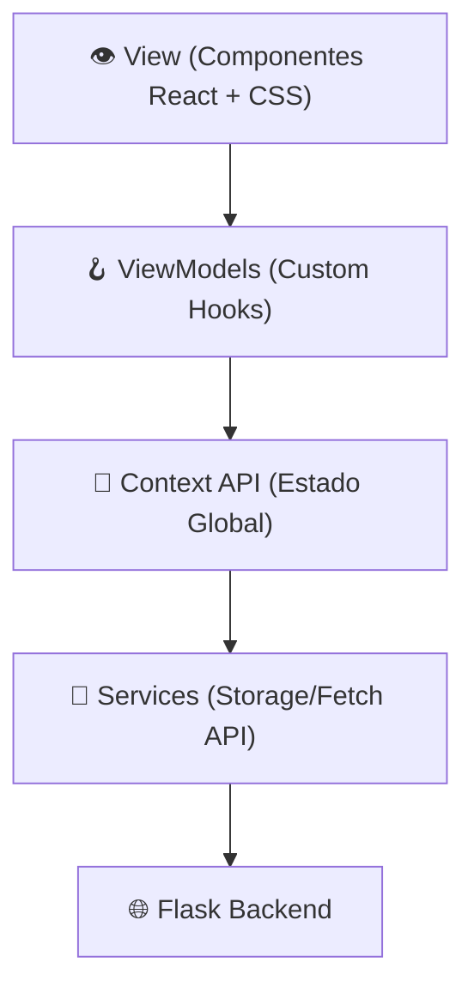

# WG-ACL Manager (Frontend)

Dashboard de control de acceso para servidores WireGuard y Home Labs con un diseño moderno (dark warm style). 

## 🚀 Funcionalidades

- **Autenticación (JWT)**
  - Pantalla de Login protegida integrada con el backend.
  - Almacenamiento seguro del token y re-hidratación de sesión automáticos (AuthContext).
- **Overview Global**
  - Panel principal con tarjetas de métricas visuales con "glow" (*peers online, reglas matriciales, roles y túnel en vivo*).
  - Barras de progreso que muestran el nivel de acceso distribuido por categorías de servicio.
- **Gestión de Peers (Clientes)**
  - Listado de dispositivos conectados.
  - Modificación en tiempo real de roles para cada dispositivo.
- **Gestión de Roles y Permisos**
  - Creación y eliminación de roles con identificadores coloreados.
- **Matriz de Acceso interactiva**
  - Tabla de privilegios bidireccional (`Roles × Servicios`).
  - Habilitar/deshabilitar servicios de manera granular con clics directos sobre la matriz.
- **YAML Engine**
  - Vista previa en vivo de la configuración ACL compatible con herramientas nativas de administración.
  - Copia al portapapeles y botón de descarga para exportar el `roles.yaml`.

## 📦 Stack Tecnológico

- **Framework:** React 18 + Vite (TypeScript)
- **Routing:** React Router v6
- **CSS:** CSS puro / Vanilla con variables predictivas en `oklch` y sistema de capas de utilidades basado en el ecosistema actual de Tailwind. 
- **Gestión de estado:** Context API + Hooks dedicados (`usePeers`, `useRoles`, etc.).
- **Despliegue:** Docker multi-stage build servido mediante Nginx alpino (`Dockerfile` & `docker-compose.yml` listos para usar en homelabs).

## 🛜 Integración con Backend

El frontend depende de una [API Flask separada](https://github.com/TBD). 
Las conexiones se realizan a través del prefijo de ruta `/api/`. 

**Para desarrollo (`npm run dev`):**
El tráfico al `/api/` es dirigido a `http://localhost:5000` mágicamente configurado en `vite.config.ts`.

**Para producción (`docker compose up`):**
El servicio asume que comparte la misma subred de Docker (`wg-acl-network`). Nginx realiza proxy_pass a las solicitudes de `/api/` al hostname interno `wg-acl-backend`.

## 💻 Desarrollo

```bash
# Instalar dependencias
npm install 

# Levantar servidor en localhost:5173
npm run dev

# Compilar para entorno productivo
npm run build
```

## 📐 Implementation Plan (Architecture)

### Patrón de Diseño General (Context API + Hooks)

El frontend fue concebido bajo un esquema de separación pura que desconecta la recolección de los datos de la lógica abstracta del componente React final.



### 1. View Layer (Pages & Components)
Ubicación: `src/pages/` y `src/components/`
- Componentes 100% enfocados en UI (botones, inputs, layouts Lovable).
- **Responsabilidad:** Renderizar información y caputurar eventos de usuario de forma "tonta" (dumb components).
- **Consumo:** Solo se comunican con los **ViewModels** internos (ej. `const { peers, toggleRole } = usePeers()`), aislando la UI de saber cómo y de dónde provienen esos the `peers`.

### 2. ViewModels (Custom Hooks)
Ubicación: `src/hooks/` (`usePeers.ts`, `useRoles.ts`, `useServices.ts`, `useYaml.ts`)
- Capa táctica entre la vista y el estado.
- **Responsabilidad:** Filtrar, mapear y agrupar arreglos complejos del State Global en estructuras fáciles de digerir. Proveen funciones limpias a la UI (ej. `getRuleCount`, `onlineCount`, `addService`).
- **Lógica de negocio:** Si hay que vincular un rol a un peer, este proxy ejecuta el despachador de la acción.

### 3. State Management (Context API & Reducers)
Ubicación: `src/context/AppContext.tsx` y `AuthContext.tsx`
- **Responsabilidad:** Ser la única fuente de la verdad para toda la aplicación interactiva.
- Utiliza la arquitectura Reducer (`useReducer`) para garantizar transiciones de estado inmutables. 
- Mapea un esquema de acciones riguroso (ej. `ADD_PEER`, `REMOVE_ROLE`, `TOGGLE_ACCESS`) previniendo colisiones de memoria o desfases visuales si dos vistas se modifican al unísono.
- Alimenta los Custom Hooks (vía `useAppContext()`).

### 4. Data Services (Infrastructure Layer)
Ubicación: `src/services/` (`storage.service.ts`)
- **Responsabilidad:** Capa límite que toca el mundo exterior (APIs, Storage). 
- Permite la portabilidad instantánea. Inicialmente hidrató la web con Data local (LocalStorage). Al completar el backend, el código transicionó automáticamente al API Fetch interceptando el host `/api/`.

### Estructura de Entidades
- **IPeer:** Representa cada cliente de la VPN (Id, Display Name, IP asignada, Status, Role vinculado).
- **IRole:** Categorías o permisos abstractos. Cada rol tiene color predictivo e ID.
- **IService:** Entidad final (App) tras la red VPN. Cuentan con Endpoint y agupación por Categoría.
- **AccessMatrix:** Sistema relacional multidireccional que inyecta/elimina accesos simplemente evaluando emparejamientos de `roleId` y `serviceId`.

### Despliegue y Proxy (Integración Docker)
La aplicación SPA es empaquetada con Multi-Stage Docker (NodeJs para compilación, Nginx para sirviente estático).
- En desarrollo (`npm run dev`), `vite.config.ts` se encarga de proxy de puerto 5173 al 5000.
- En producción (`docker compose up`), la configuración `nginx.conf` enruta cualquier llamada de `/api/*` inter-contenedores usando el nombre global de red `wg-acl-backend`.
